# 🛒 SmartShelf AI

SmartShelf AI is a low-cost, modular AI system designed to prevent product spoilage and improve transparency in retail shops. It leverages Raspberry Pi, computer vision (OCR), smart notifications, and a modern dashboard to help staff identify expired or fake products, receive early alerts, and take timely action to reduce waste and losses.

---

## 🎬 Usage Demo


*_(Demo GIF: Shows staff logging in, scanning a product, and receiving an alert. Replace with your own GIF in `docs/demo.gif`)_*

---

## ✨ Key Features
- 📷 **Camera-based expiry date detection** using OCR
- 🕵️‍♂️ **Identification of expired and fake products**
- 📱 **NFC tap-to-check expiry** (optional)
- 💡 **LED visual alerts** (Red/Green) for shelf status
- 📊 **Mobile-friendly dashboard** for staff
- 📲 **SMS/WhatsApp expiry notifications**
- ⏰ **Early alerts** for near-expiry products
- 📈 **Predictive analytics** (future upgrade)
- 🔗 **Blockchain expiry verification** (future upgrade)
- 🕶️ **Augmented Reality expiry visualization** (future upgrade)

---

## 🗂️ Project Structure

```
smartshelf-ai/
  backend/                # All Python logic (Flask app, camera, OCR, LED, notifications, upgrades)
  frontend/
    templates/            # HTML templates (dashboard UI)
    static/               # CSS and JavaScript assets
  hardware/               # Camera and LED control modules
  ocr/                    # OCR and date parsing modules
  notifications/          # SMS and WhatsApp notification modules
  dashboard/              # (Legacy) Simple Flask dashboard
  tests/                  # Test scripts
  blockchain.py           # Future upgrade module
  flash_sale.py           # Future upgrade module
  ar_overlay.py           # Future upgrade module
  main.py                 # Main Flask app (serves frontend and API)
  requirements.txt        # Python dependencies
  README.md               # Project documentation
```

---

## 🏗️ Architecture

- **Backend**: Python Flask app handles all business logic, product storage (JSON), camera/OCR, LED control, notifications, and API endpoints. All sensitive actions require staff authentication.
- **Frontend**: HTML/CSS/JavaScript dashboard (served by Flask) for staff to log in, view product statuses, and trigger actions. Data is fetched dynamically from backend APIs.

### 🖼️ System Architecture Diagram

```mermaid
flowchart TD
    subgraph User
        Staff["👩‍💼 Staff"]
    end
    subgraph Frontend
        Dashboard["📊 Dashboard (HTML/JS)"]
    end
    subgraph Backend
        Flask["🐍 Flask API"]
        Camera["📷 Camera Module"]
        OCR["🔤 OCR (pytesseract)"]
        LED["💡 LED Control"]
        Notify["📲 Notifications"]
        Storage["🗄️ JSON Storage"]
    end
    subgraph Hardware
        Pi["🍓 Raspberry Pi"]
        NFC["📱 NFC Tag"]
        LEDHW["💡 LED Strip"]
    end
    Staff-->|Login, Actions|Dashboard
    Dashboard-->|API Calls|Flask
    Flask-->|Scan|Camera
    Camera-->|Image|OCR
    OCR-->|Expiry Date|Flask
    Flask-->|Update|Storage
    Flask-->|Control|LED
    Flask-->|Send|Notify
    Flask-->|Serve|Dashboard
    Pi-->|Controls|Camera
    Pi-->|Controls|LEDHW
    Pi-->|Reads|NFC
```



---

## 🔌 API Endpoints & Example Requests

All endpoints (except login/logout) require authentication (session cookie).

### 🔑 Authentication

**Login**
```http
POST /login
Content-Type: application/json

{
  "username": "admin",
  "password": "admin123"
}
```

**Logout**
```http
POST /logout
```

### 📦 Products

**Get all products**
```http
GET /api/products
```

**Add a product**
```http
POST /api/products
Content-Type: application/json

{
  "name": "Milk",
  "expiry": "2025-12-31"
}
```

**Edit a product**
```http
PUT /api/products/<id>
Content-Type: application/json

{
  "name": "Yogurt",
  "expiry": "2024-08-01"
}
```

**Delete a product**
```http
DELETE /api/products/<id>
```

**Mark as checked**
```http
POST /api/products/<id>/check
```

### 🖼️ Scan & Alerts

**Trigger scan (OCR)**
```http
POST /api/scan
```

**Send notifications**
```http
POST /api/alerts
```

---

## 🛠️ Hardware Requirements
- 🍓 Raspberry Pi 4 (or similar SBC)
- 📷 Pi Camera (for label scanning)
- 📱 NFC Stickers (optional)
- 💡 LED Strips (for shelf alerts)
- 🔋 Power Bank/Battery (for portability)

---

## 💻 Software Requirements
- 🐍 Python 3.7+
- Flask
- OpenCV
- pytesseract
- RPi.GPIO
- twilio
- (see `requirements.txt` in `smartshelf-ai`)

---

## 🚀 Setup & Usage
1. Clone this repository and navigate to `smartshelf-ai`:
   ```bash
   cd smartshelf-ai
   pip install -r requirements.txt
   ```
2. Run the backend Flask app:
   ```bash
   python main.py
   ```
3. Open your browser and go to `http://localhost:5000` to access the dashboard.
4. Log in with the default credentials (`admin` / `admin123`).

---

## 🔄 Workflow Diagram

```mermaid
sequenceDiagram
    participant Staff as 👩‍💼 Staff
    participant Dashboard as 📊 Dashboard
    participant API as 🐍 Flask API
    participant Camera as 📷 Camera
    participant OCR as 🔤 OCR
    participant Storage as 🗄️ Storage
    participant LED as 💡 LED
    participant Notify as 📲 Notify
    Staff->>Dashboard: Login, Actions
    Dashboard->>API: API Request (e.g., scan)
    API->>Camera: Trigger scan
    Camera->>OCR: Send image
    OCR->>API: Extract expiry date
    API->>Storage: Update product info
    API->>LED: Set shelf status
    API->>Notify: Send alerts
    API->>Dashboard: Respond with status
```



---

## 🧑‍💻 How It Works
- Staff log in to the dashboard and see a table of products, color-coded by expiry status (🔴/🟡/🟢).
- Products can be added, edited, deleted, or marked as checked.
- The system can scan product labels using the camera and extract expiry dates via OCR.
- LED strips provide visual shelf alerts.
- Notifications are sent via SMS/WhatsApp for urgent cases.

---

## 🔮 Future Enhancements
- 🔗 Blockchain-based expiry records
- ⚡ Flash Sale auto-discounts for near-expiry products
- 🕶️ Augmented Reality expiry visualization
- 📈 Predictive analytics for inventory management

---

## 🤝 Contributing
Pull requests and suggestions are welcome! For major changes, please open an issue first to discuss what you would like to change.

---

## 📝 License
MIT License